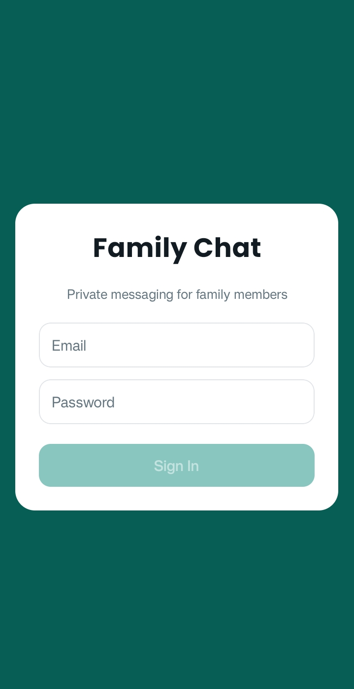
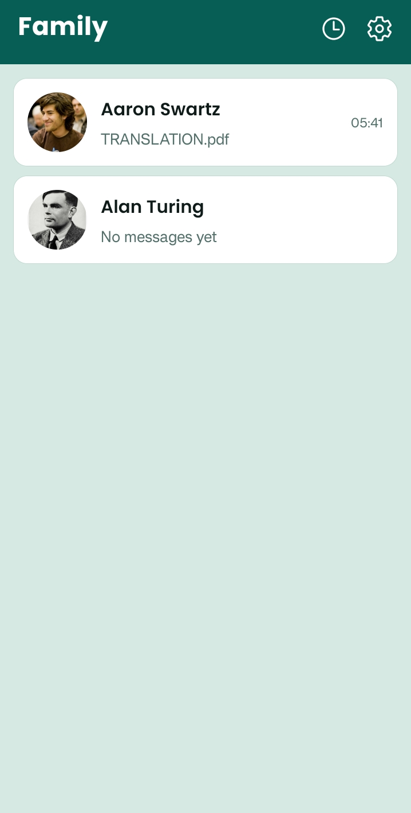
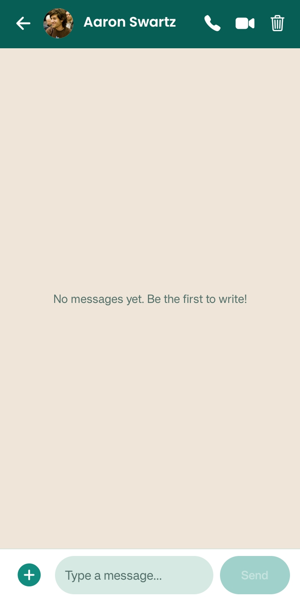
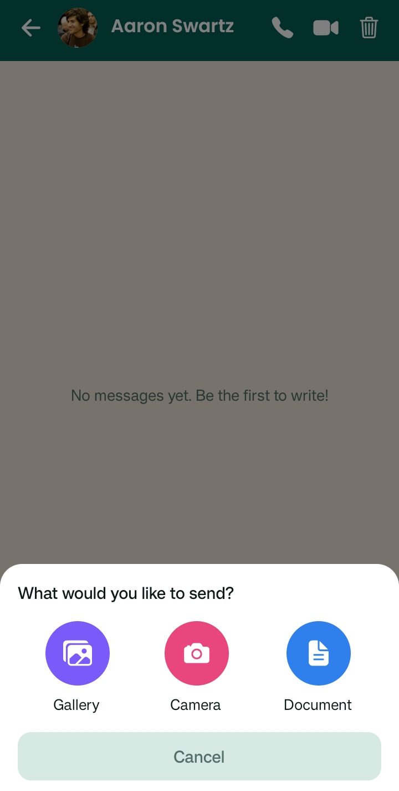
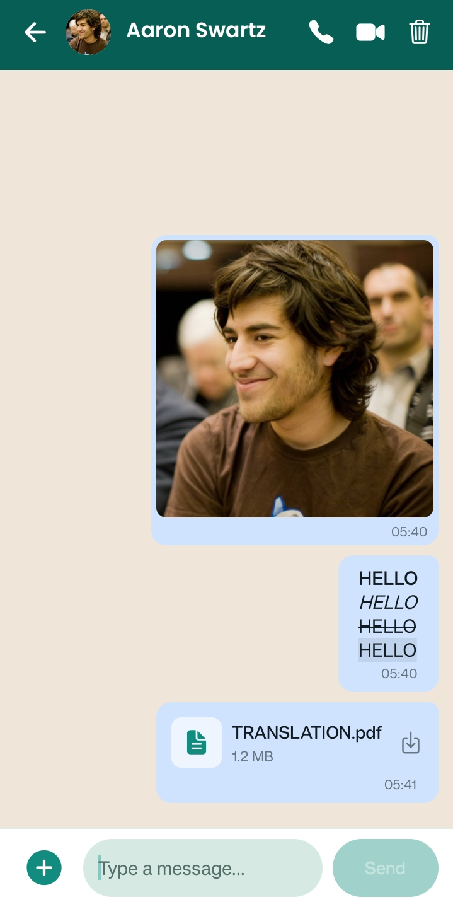
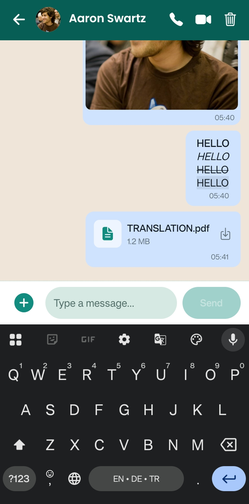
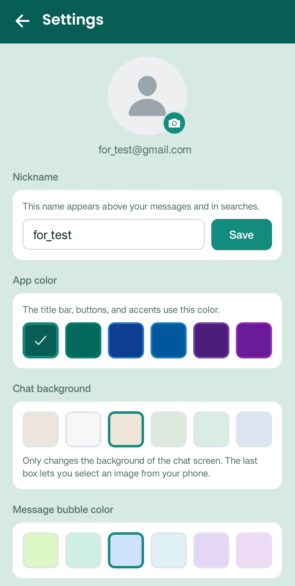
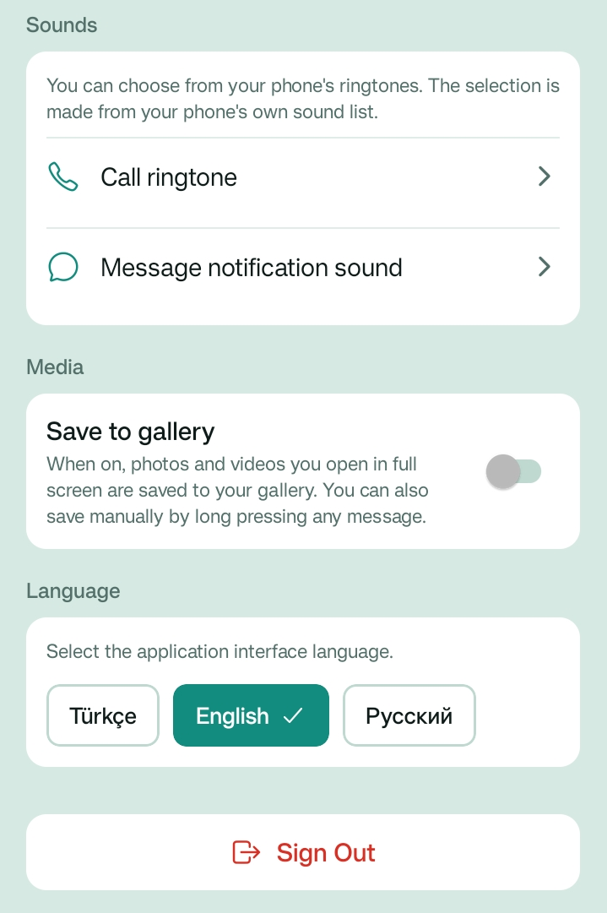

# Family Chat

A modern, private, and serverless chat application designed exclusively for families and close private groups. Featuring real-time messaging, encrypted peer-to-peer voice and video calls, rich media & document sharing, push notifications, customizable color themes, and multi-language support (English, Turkish, Russian).

Built with **React Native**, **Expo (SDK 57)**, **Firebase**, and **WebRTC**.

---

## Screenshots & Feature Walkthrough

Explore the key screens and capabilities of Family Chat:

### 1. Secure & Private Authentication
<p align="center">
  
</p>

- **Private Group Protection**: Open public registration is disabled by design. Only accounts provisioned by the family administrator in the Firebase Console can sign in, ensuring complete privacy and isolation from the public internet.
- **Persistent Session**: Users remain securely signed in across app launches without needing to re-enter credentials every time.
- **Firebase Auth Security**: Built-in authentication handling with encrypted token storage.

---

### 2. Family & Direct Chat Hub
<p align="center">
  
</p>

- **Central Conversation List**: View all active conversations with family members, profile pictures, and dynamic timestamps.
- **Strict Membership Privacy**: Groups and direct chats are strictly rendered only for their actual participants. Users outside a group cannot view or access it.
- **Quick Header Actions**:
  - **Call History** (Clock icon): One-tap navigation to the call log.
  - **Settings** (Gear icon): Instant access to personalization, sounds, and language preferences.
- **Real-Time Synchronization**: Chat cards live-update whenever new messages or documents are received.

---

### 3. Direct One-on-One Conversation
<p align="center">
  
</p>

- **Clean & Distraction-Free Messaging**: Dedicated chat screen featuring participant profile details.
- **One-Tap Voice & Video Calls**: Directly initiate peer-to-peer audio calls (`📞`) or video calls (`📹`) with a single tap from the header bar.
- **Local Chat Clearing**: Tap the trash icon (`🗑️`) to clear your local message history on your device without affecting the other member's messages.
- **Intuitive Composer**: Quick attachment button (`+`), expandable multiline input, and send button.

---

### 4. Media & Attachment Options
<p align="center">
  
</p>

- **Gallery**: Select high-resolution pictures and videos directly from your device's photo gallery.
- **Camera**: Snap real-time photos or record videos without leaving the application.
- **Document**: Send PDF documents, spreadsheets, text files, or presentations up to Cloudinary storage limits.

---

### 5. Rich Text Formatting & Multimedia Feed
<p align="center">
  
</p>

- **High-Resolution Photo Sharing**: Inline image previews with rounded bubble cards and timestamps.
- **Rich Text Markdown Support**:
  - `*bold*` renders as **bold**
  - `_italic_` renders as _italic_
  - `~strikethrough~` renders as ~strikethrough~
  - ````monospace```` renders as `monospace`
- **Interactive Document Cards**: Documents (e.g. PDF) show file extension icon, document name (`TRANSLATION.pdf`), file size (`1.2 MB`), and an interactive download/open button that opens the document in your device's default reader.
- **Message Recall (Unsend)**: Long-press any message you sent to recall/unsend it if the other member hasn't read it yet.
- **Full-Screen Media Viewer**: Tap any photo or video to open the full-screen viewer with pinch-to-zoom and one-tap save to phone gallery.

---

### 6. Responsive Keyboard & Composer Layout
<p align="center">
  
</p>

- **Smooth Keyboard Avoidance**: The input bar dynamically lifts above the software keyboard without obscuring the chat history or cutting off text.
- **Auto-Expanding Input**: Text area automatically expands with multiple lines of text while retaining clean padding.
- **Disabled State**: Send button is gracefully disabled when the input field is empty to prevent accidental empty messages.

---

### 7. Profile & Theme Personalization
<p align="center">
  
</p>

- **Profile Photo Management**: Upload or remove your avatar with instant real-time synchronization across all family members' screens.
- **Custom Nickname**: Change your display nickname at any time.
- **App Color Themes**: Choose your favorite primary color palette (Emerald Green, Teal, Navy Blue, Royal Blue, Deep Purple, Violet) to restyle header bars, buttons, and system accents.
- **Chat Wallpapers**: Select from beautiful pastel color presets or pick any photo from your phone gallery as your chat background.
- **Custom Message Bubble Colors**: Personalize the bubble color of your outgoing messages.

---

### 8. Sound Preferences, Media Automation & Multi-Language
<p align="center">
  
</p>

- **Custom System Sounds**: Select ringtones and message notification sounds directly from your phone's native sound picker.
- **Auto-Save to Gallery**: Automatically save received photos and videos to the device gallery album ("Family Chat") upon viewing.
- **Instant Multi-Language Switching**: Seamlessly switch the entire application interface between:
  - **Türkçe** (Turkish)
  - **English** (English)
  - **Русский** (Russian)
  *Translations apply instantly across all screens with no app restart required.*
- **Secure Sign Out**: Clears notification tokens and marks user as offline in Firestore, preventing ghost ringtones or alerts when logged out.

---

### 9. Call History & Log Management
<p align="center">
  
</p>

- **Comprehensive Call Log**: Displays all past voice and video calls with peer name, date, time, and duration.
- **Directional Indicators**:
  - `↓` **Incoming**: Answered incoming calls.
  - `↑` **Outgoing**: Calls initiated by you.
  - **Missed**: Calls that were unanswered or rejected.
- **Call Log Deletion**: Press and hold any call entry to permanently delete it from your history.

---

## Features Summary

- **Real-Time Messaging**: Instant chat sync powered by Firebase Firestore snapshots.
- **Voice & Video Calling**: Peer-to-peer WebRTC calls with STUN/TURN traversal.
- **Presence & Offline Checks**: Automatically detects if a user is logged in before placing calls, preventing unreachable calls.
- **Push Notifications**: Expo Serverless Push Notifications with channel separation (priority ringtones for calls, standard tones for messages).
- **Serverless Storage**: Photos, videos, and documents stored on Cloudinary.
- **Read Receipts & Unsend**: Double checkmarks for read messages; unsend capability before read receipt.
- **Multi-Language (i18n)**: Fully translated in English, Turkish, and Russian.
- **Dark/Light Theme Customization**: Custom color palettes, chat wallpapers, and bubble colors.

---

## Tech Stack

- **Framework**: [Expo](https://expo.dev/) (SDK 57), [React Native](https://reactnative.dev/) (0.86), React 19
- **Database & Auth**: [Firebase](https://firebase.google.com/) (Firestore & Firebase Authentication)
- **Real-Time Calling**: WebRTC peer-to-peer with audio/video tracks
- **Media & Document Storage**: [Cloudinary](https://cloudinary.com/) (unsigned direct upload)
- **Push Notifications**: Expo Push API & Android Notification Channels
- **Language**: TypeScript (strict mode)

---

## Prerequisites & Installation

For a step-by-step walkthrough of configuring Firebase, Cloudinary, and compiling the APK, see [SETUP.md](SETUP.md).

### Quick Commands

```bash
# Install dependencies
npm install

# Typecheck TypeScript
npx tsc --noEmit

# Verify Firebase setup
npm run verify

# Build & install APK on connected Android phone
npm run apk
```

---

## License

This project is licensed under the [MIT License](LICENSE).
